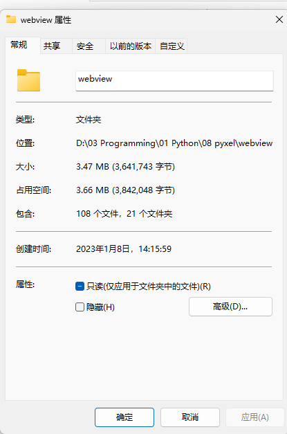

## 名称和说明
网页展示器，使用于预览网页，使用**Windows Webview2 Runtime**
**Webview** 是用python的pywebview预览网页的



_看，我把它打包到4M以内_，[主要用了pystand项目](https://github.com/skywind3000/PyStand)

## 特性介绍
* 大小在**4M**以内
* 谷歌内核展示网页, Windows自带内核
* 运行速度非常快，1秒就能启动
* 文件夹非常简洁
* 只能在**Windows 7**以上运行


## 程序运行说明

源代码很短，只有24行，贮存在main.py里，[pywebview](https://github.com/r0x0r/pywebview)模块预览网页的常规代码。源代码如下：
```
# coding = utf-8
import webview
with open(".\config.json", "r", encoding="utf-8") as file:
    data = file.read()
config = str()
exec("config = " + data)

webview.create_window(title=config['window']['title'],
                      url=config['window']['url'],
                      width=config['window']['width'],
                      height=config['window']['height'],
                      resizable=config['size']['resizable'],
                      fullscreen=config['size']['fullscreen'],
                      min_size=config['size']['min_size'],
                      frameless=config['frameless']['frameless'],
                      easy_drag=config['frameless']['easy_drag'],
                      minimized=config['state']['minimized'],
                      on_top=config['state']['on_top'],
                      confirm_close=config['state']['confirm_close'],
                      background_color=config['web']['background_color'],
                      transparent=config['web']['transparent'],
                      text_select=config['web']['text_select']
                      )
webview.start()
```
### 需求（requirements.txt)
```
python >= 3.6 (我用的3.8)
pywebview ~= 3.7.2 (预览网页的主要模块)
proxy-tools (pywenview的依赖)
pythonnet (pywenview的依赖)
```


## config.json说明
```
{
    "window": {
        "title": "网页展示",
        "url": "https://pywebview.flowrl.com/hello",
        "width": 800,
        "height": 600
    },
    "size": {
        "resizable": 1,
        "fullscreen": 0,
        "min_size": (200, 100)
    },
    "frameless": {
        "frameless": 0,
        "easy_drag": 1
    },
    "state": {
        "minimized": 0,
        "on_top": 0,
        "confirm_close": 0
    },
    "web": {
        "background_color": "#FFFFFF",
        "text_select": 0,
        "transparent": 0
    }
}
```

### 参数介绍
* title: 窗口标题
* url: 要加载的URL
* width: 窗口宽度。默认值为800px
* height: 窗口高度。默认值为600px
* resizable: 如果可以调整窗口大小，则为True，否则为False。默认值为True
* fullscreen: 如果以全屏模式启动，则为True。默认值为False
* min_size: 指定最小窗口大小的（width，height）元组。默认值为200x100
* frameless: 窗口是否应有框架。
* easy_drag: 当窗口为无框架时，可以轻松拖动窗口。
* minimized: 显示窗口最小化
* on_top: 将窗口保持在其他窗口之上（所需操作系统：windows）
* confirm_close: 显示窗口关闭确认对话框。默认值为False
* background_color: 加载webview内容之前显示的十六进制字符串的背景色。默认值为白色。
* text_select: 允许在页面上选择文本。默认值为False。
* transparent: 不要绘制窗口背景。

## webviw打包说明
* webview文件夹下就是打包文件
* library文件夹是用到的第三方库
* depend.dll其实就是python3.dll
* app下存放你的网页文件，并要在config.json中修改


# 最最后，给我一颗星星吧！